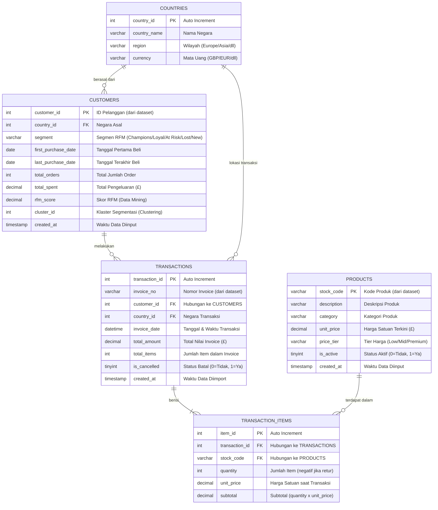
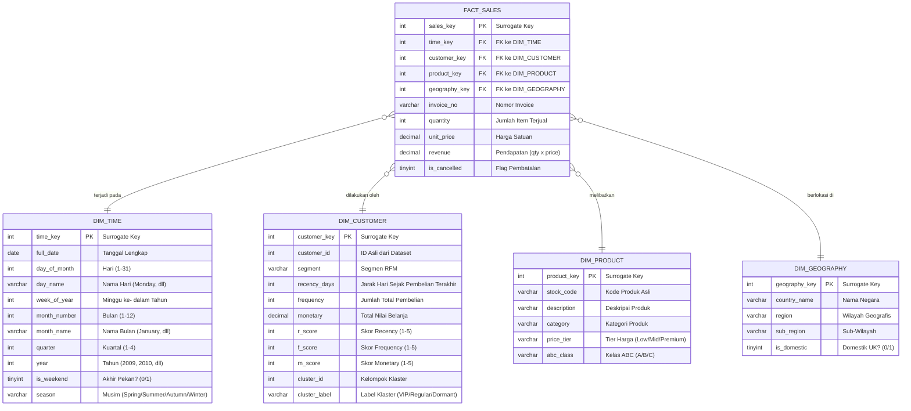

# Rencana Implementasi: Perancangan Database & Business Intelligence Online Retail

Dokumen ini berisi spesifikasi perancangan database **OLTP** (untuk operasional website) dan **OLAP** (Star Schema untuk Business Intelligence), kamus data lengkap, pemetaan ETL, logika integrasi Data Mining/Clustering, serta rancangan antarmuka (wireframe) website yang akan dibuat.

---

## 🎯 Top 5 BI Features

Dokumen dan aplikasi Business Intelligence ini mengimplementasikan 5 fitur utama sesuai standar BI:

| No | Fitur BI | Deskripsi Implementasi | Lokasi di Document / App |
|---|---|---|---|
| 1 | **Analysis Services** | Analisis RFM (Recency, Frequency, Monetary) untuk scoring & segmentasi nilai pelanggan | Section 4 & Page `/customers` |
| 2 | **Integration Services** | Pipeline ETL (Extract, Transform, Load) untuk membaca CSV, validasi data, & logging | Section 5 & Page `/import` |
| 3 | **Data Mining** | ABC Analysis (Pareto 80/20) revenue produk & Market Basket Analysis (Association Rules) | Section 4 & Page `/products` & `/mining` |
| 4 | **Reporting Services** | Laporan bulanan, laporan per negara, dan MySQL Views analitik dengan fitur Export CSV | Section 4 & Page `/reports` |
| 5 | **Clustering Support** | K-Means Clustering ($k=4$) untuk pengelompokan pelanggan (VIP, Regular, Dormant, One-Time) | Section 4 & Page `/clustering` |

---


## User Review Required

> [!IMPORTANT]
> **Integrasi Hasil Data Mining & Clustering ke Kolom Database**:
> Agar website PHP dapat menampilkan hasil analisis canggih dengan cepat, kami telah merancang kolom khusus pada database operasional (`rfm_score` untuk skor nilai pelanggan dan `cluster_id` untuk kelompok segmentasi pelanggan). Nilai pada kolom ini akan dihitung oleh proses background engine secara periodik lalu disimpan permanen di database MySQL.

> [!TIP]
> **Star Schema untuk Analysis & Reporting**:
> Struktur OLAP dirancang dengan bentuk **Bintang (Star Schema)**. Desain ini memisahkan tabel fakta (berisi ukuran angka seperti revenue dan quantity) dengan tabel dimensi (berisi kategori seperti waktu, produk, dan pelanggan). Hal ini sangat mempercepat query pembuatan grafik di dashboard web Anda.

---

## Open Questions

> [!WARNING]
> Mohon konfirmasi beberapa aturan bisnis berikut sebelum database dibuat:
> 1. **Penanganan Transaksi Cancelled**: Invoice yang diawali huruf `C` (misal: `C489449`) adalah transaksi pembatalan/retur. Di rancangan ini, kami menyimpan data tersebut dengan flag `is_cancelled = 1` dan `quantity` bernilai negatif. Apakah ini sudah sesuai kebijakan bisnis Anda?
> 2. **Customer ID Kosong (NULL)**: Sekitar ~25% transaksi tidak memiliki Customer ID (pembelian tamu/guest). Di rancangan ini, kami akan memasukkannya ke tabel pelanggan dengan `customer_id = 0` berlabel `'Guest Customer'`. Apakah ini sudah sesuai?
> 3. **Kategori Harga Produk**: Untuk dimensi produk, kami membagi harga ke dalam 3 tier: `Low` (< £2), `Mid` (£2–£10), `Premium` (> £10). Apakah pengelompokan ini sesuai kebutuhan analisis Anda?

---

## Proposed Changes

### 1. Entity Relationship Diagram (ERD) - Skema OLTP
Skema ini dirancang ternormalisasi (3NF) untuk menjamin konsistensi data operasional website saat melakukan input, update, atau hapus data transaksi.



---

### 2. Kamus Data Database OLTP (MySQL)

Berikut adalah detail tipe data, constraints, dan penjelasan untuk setiap tabel operasional:

#### Tabel: `countries`
| Nama Kolom | Tipe Data | Atribut / Constraint | Deskripsi |
| :--- | :--- | :--- | :--- |
| `country_id` | INT | Primary Key, Auto Increment | ID unik negara. |
| `country_name` | VARCHAR(100) | NOT NULL, UNIQUE | Nama lengkap negara (misal: 'United Kingdom'). |
| `region` | VARCHAR(50) | DEFAULT 'Unknown' | Wilayah geografis (misal: 'Europe', 'Asia'). |
| `currency` | VARCHAR(10) | DEFAULT 'GBP' | Kode mata uang (misal: 'GBP', 'EUR'). |

#### Tabel: `customers`
| Nama Kolom | Tipe Data | Atribut / Constraint | Deskripsi |
| :--- | :--- | :--- | :--- |
| `customer_id` | INT | Primary Key | ID pelanggan (langsung dari kolom `Customer ID` dataset). |
| `country_id` | INT | Foreign Key (`countries.country_id`) | Negara asal pelanggan. |
| `segment` | VARCHAR(30) | DEFAULT 'New' | Segmen RFM: 'Champions', 'Loyal', 'At Risk', 'Lost', 'New'. |
| `first_purchase_date` | DATE | NULL | Tanggal pertama kali pelanggan bertransaksi. |
| `last_purchase_date` | DATE | NULL | Tanggal terakhir kali pelanggan bertransaksi. |
| `total_orders` | INT | DEFAULT 0 | Total jumlah invoice unik milik pelanggan. |
| `total_spent` | DECIMAL(12,2) | DEFAULT 0.00 | Akumulasi total pengeluaran pelanggan (£). |
| `rfm_score` | DECIMAL(5,2) | NULL | Skor gabungan RFM hasil kalkulasi Data Mining (0-100). |
| `cluster_id` | INT | NULL | ID klaster dari proses K-Means Clustering. |
| `created_at` | TIMESTAMP | DEFAULT CURRENT_TIMESTAMP | Waktu record pelanggan pertama kali dibuat. |

#### Tabel: `products`
| Nama Kolom | Tipe Data | Atribut / Constraint | Deskripsi |
| :--- | :--- | :--- | :--- |
| `stock_code` | VARCHAR(20) | Primary Key | Kode produk unik dari kolom `StockCode` dataset. |
| `description` | VARCHAR(255) | NOT NULL | Nama/deskripsi produk dari kolom `Description`. |
| `category` | VARCHAR(50) | DEFAULT 'General' | Kategori produk (hasil klasifikasi ETL). |
| `unit_price` | DECIMAL(10,2) | NOT NULL | Harga satuan produk terkini dalam Pound Sterling. |
| `price_tier` | VARCHAR(10) | NOT NULL | Tier harga: 'Low' (< £2), 'Mid' (£2-£10), 'Premium' (> £10). |
| `is_active` | TINYINT(1) | DEFAULT 1 | Status ketersediaan produk (1=Aktif, 0=Tidak Aktif). |
| `created_at` | TIMESTAMP | DEFAULT CURRENT_TIMESTAMP | Waktu data produk pertama kali diinput. |

#### Tabel: `transactions`
| Nama Kolom | Tipe Data | Atribut / Constraint | Deskripsi |
| :--- | :--- | :--- | :--- |
| `transaction_id` | INT | Primary Key, Auto Increment | ID unik internal per transaksi. |
| `invoice_no` | VARCHAR(20) | NOT NULL, INDEX | Nomor invoice dari kolom `Invoice` dataset. |
| `customer_id` | INT | Foreign Key (`customers.customer_id`), NULL | ID pelanggan; NULL atau 0 untuk transaksi tamu (guest). |
| `country_id` | INT | Foreign Key (`countries.country_id`) | Negara tempat transaksi terjadi. |
| `invoice_date` | DATETIME | NOT NULL | Tanggal dan waktu lengkap transaksi dari kolom `InvoiceDate`. |
| `total_amount` | DECIMAL(12,2) | NOT NULL | Total nilai satu invoice (£): jumlah semua subtotal item. |
| `total_items` | INT | NOT NULL | Jumlah item (baris) dalam satu invoice. |
| `is_cancelled` | TINYINT(1) | DEFAULT 0 | Flag pembatalan: 1 jika `Invoice` diawali huruf 'C'. |
| `created_at` | TIMESTAMP | DEFAULT CURRENT_TIMESTAMP | Waktu data diimport ke sistem. |

#### Tabel: `transaction_items`
| Nama Kolom | Tipe Data | Atribut / Constraint | Deskripsi |
| :--- | :--- | :--- | :--- |
| `item_id` | INT | Primary Key, Auto Increment | ID unik per baris item transaksi. |
| `transaction_id` | INT | Foreign Key (`transactions.transaction_id`) | Menghubungkan item ke header transaksi. |
| `stock_code` | VARCHAR(20) | Foreign Key (`products.stock_code`) | Kode produk yang dibeli. |
| `quantity` | INT | NOT NULL | Jumlah item; negatif (-) untuk transaksi retur/cancelled. |
| `unit_price` | DECIMAL(10,2) | NOT NULL | Harga satuan aktual saat transaksi terjadi (dari kolom `Price`). |
| `subtotal` | DECIMAL(12,2) | NOT NULL | Kalkulasi: `quantity x unit_price`. |

---

### 3. Skema Data Warehouse (OLAP) — Star Schema

Skema ini dirancang untuk mempercepat query analitik di dashboard. Semua tabel dimensi terhubung langsung ke satu tabel fakta pusat.



---

### 4. Tabel Pendukung Fitur BI

#### Analysis Services — Tabel RFM

```sql
CREATE TABLE analytics_rfm (
    customer_id     INT PRIMARY KEY,
    recency_days    INT            COMMENT 'Selisih hari dari tanggal terakhir beli ke referensi',
    frequency       INT            COMMENT 'Jumlah invoice unik milik pelanggan',
    monetary        DECIMAL(12,2)  COMMENT 'Total nilai belanja dalam Pound Sterling',
    r_score         TINYINT        COMMENT 'Skor Recency 1-5 (5 = paling baru)',
    f_score         TINYINT        COMMENT 'Skor Frequency 1-5 (5 = paling sering)',
    m_score         TINYINT        COMMENT 'Skor Monetary 1-5 (5 = paling besar)',
    rfm_segment     VARCHAR(30)    COMMENT 'Label: Champions, Loyal, At Risk, dll',
    calculated_at   TIMESTAMP DEFAULT CURRENT_TIMESTAMP
);
```

#### Integration Services — Tabel Log ETL

```sql
CREATE TABLE etl_log (
    log_id          INT AUTO_INCREMENT PRIMARY KEY,
    source_file     VARCHAR(255)   COMMENT 'Nama file CSV yang diimport',
    total_rows      INT            COMMENT 'Total baris dalam file',
    success_rows    INT            COMMENT 'Baris berhasil diimport',
    failed_rows     INT            COMMENT 'Baris gagal diimport',
    error_details   TEXT           COMMENT 'Rincian error dalam format JSON',
    started_at      DATETIME,
    completed_at    DATETIME,
    status          ENUM('running','success','failed','partial')
);

CREATE TABLE etl_staging (
    staging_id      INT AUTO_INCREMENT PRIMARY KEY,
    raw_invoice     VARCHAR(50),
    raw_stockcode   VARCHAR(50),
    raw_description TEXT,
    raw_quantity    VARCHAR(20),
    raw_date        VARCHAR(50),
    raw_price       VARCHAR(20),
    raw_customerid  VARCHAR(20),
    raw_country     VARCHAR(100),
    is_valid        TINYINT DEFAULT 0,
    error_reason    VARCHAR(255),
    loaded_at       TIMESTAMP DEFAULT CURRENT_TIMESTAMP
);
```

#### Data Mining — Tabel Association Rules & ABC Analysis

```sql
CREATE TABLE mining_association_rules (
    rule_id         INT AUTO_INCREMENT PRIMARY KEY,
    antecedent      VARCHAR(100)   COMMENT 'Produk A (pemicu)',
    consequent      VARCHAR(100)   COMMENT 'Produk B (yang ikut dibeli)',
    support         DECIMAL(6,4)   COMMENT 'Frekuensi kemunculan bersama',
    confidence      DECIMAL(6,4)   COMMENT 'Probabilitas B dibeli jika A dibeli',
    lift            DECIMAL(8,4)   COMMENT 'Kekuatan asosiasi (> 1 = signifikan)',
    created_at      TIMESTAMP DEFAULT CURRENT_TIMESTAMP
);

CREATE TABLE mining_product_abc (
    stock_code      VARCHAR(20) PRIMARY KEY,
    description     VARCHAR(255),
    total_revenue   DECIMAL(12,2),
    revenue_pct     DECIMAL(5,2)   COMMENT 'Persentase dari total revenue',
    cumulative_pct  DECIMAL(5,2)   COMMENT 'Persentase kumulatif',
    abc_class       CHAR(1)        COMMENT 'A = Top 80%, B = 80-95%, C = sisanya'
);
```

#### Clustering Support — Tabel Segmentasi Pelanggan

```sql
CREATE TABLE clustering_customer_groups (
    cluster_id      INT,
    customer_id     INT,
    cluster_label   VARCHAR(30)    COMMENT 'VIP, Regular, Dormant, One-Time',
    centroid_r      DECIMAL(8,4)   COMMENT 'Nilai pusat klaster: Recency',
    centroid_f      DECIMAL(8,4)   COMMENT 'Nilai pusat klaster: Frequency',
    centroid_m      DECIMAL(8,4)   COMMENT 'Nilai pusat klaster: Monetary',
    assigned_at     TIMESTAMP DEFAULT CURRENT_TIMESTAMP,
    PRIMARY KEY (cluster_id, customer_id)
);
```

#### Reporting Services — MySQL Views

```sql
-- View: Penjualan Bulanan
CREATE VIEW vw_monthly_sales AS
SELECT
    YEAR(invoice_date)      AS year,
    MONTH(invoice_date)     AS month,
    MONTHNAME(invoice_date) AS month_name,
    COUNT(DISTINCT invoice_no)   AS total_orders,
    COUNT(DISTINCT customer_id)  AS unique_customers,
    SUM(total_amount)            AS total_revenue,
    AVG(total_amount)            AS avg_order_value
FROM transactions
WHERE is_cancelled = 0
GROUP BY YEAR(invoice_date), MONTH(invoice_date);

-- View: Top Produk berdasarkan Revenue
CREATE VIEW vw_top_products AS
SELECT
    p.stock_code,
    p.description,
    p.price_tier,
    SUM(ti.quantity)                  AS total_qty_sold,
    SUM(ti.subtotal)                  AS total_revenue,
    COUNT(DISTINCT ti.transaction_id) AS order_count
FROM transaction_items ti
JOIN products p     ON ti.stock_code     = p.stock_code
JOIN transactions t ON ti.transaction_id = t.transaction_id
WHERE t.is_cancelled = 0 AND ti.quantity > 0
GROUP BY p.stock_code, p.description, p.price_tier
ORDER BY total_revenue DESC;

-- View: Penjualan per Negara
CREATE VIEW vw_sales_by_country AS
SELECT
    c.country_name,
    c.region,
    COUNT(DISTINCT t.invoice_no)   AS total_orders,
    COUNT(DISTINCT t.customer_id)  AS unique_customers,
    SUM(t.total_amount)            AS total_revenue
FROM transactions t
JOIN countries c ON t.country_id = c.country_id
WHERE t.is_cancelled = 0
GROUP BY c.country_name, c.region
ORDER BY total_revenue DESC;
```

---

### 5. Pemetaan ETL (Extract, Transform, Load)

#### Tahap Extract
| Sumber | Keterangan |
| :--- | :--- |
| File `online_retail_II_20000.csv` | File data mentah utama dengan 20.000 baris transaksi |

#### Tahap Transform (Aturan Pembersihan Data)

| Kolom Sumber (CSV) | Kolom Tujuan (Database) | Aturan Transformasi |
| :--- | :--- | :--- |
| `Invoice` | `transactions.invoice_no` | Simpan apa adanya. Jika diawali 'C' maka set `is_cancelled = 1` |
| `StockCode` | `products.stock_code` | Trim spasi. Skip jika berupa kode non-produk (misal: 'POST', 'DOT', 'BANK') |
| `Description` | `products.description` | Trim spasi awal dan akhir. Title Case. |
| `Quantity` | `transaction_items.quantity` | Simpan apa adanya (boleh negatif untuk retur) |
| `InvoiceDate` | `transactions.invoice_date` | Parse format `YYYY-MM-DD HH:MM:SS` ke DATETIME MySQL |
| `Price` | `transaction_items.unit_price` | Skip baris jika `Price <= 0` (kecuali retur) |
| `Customer ID` | `customers.customer_id` | Jika NULL/kosong maka gunakan `customer_id = 0` (Guest) |
| `Country` | `countries.country_name` | Lookup/Insert ke tabel `countries`. Normalkan nama negara. |

#### Tahap Load (Urutan Insert)

```
1. countries         <- Insert negara unik terlebih dahulu (master data)
2. customers         <- Insert pelanggan unik (customer_id dari dataset)
3. products          <- Insert produk unik (stock_code dari dataset)
4. transactions      <- Insert header invoice unik
5. transaction_items <- Insert setiap baris item transaksi
```

---

### 6. Rancangan Aplikasi Website (PHP + MySQL)

#### Stack Teknologi yang Digunakan

| Layer | Teknologi | Keterangan |
| :--- | :--- | :--- |
| **Backend** | PHP 8.x | Logika server, ETL, kalkulasi analitik |
| **Database** | MySQL 8.x | OLTP + OLAP (Star Schema) |
| **Frontend** | HTML5 + CSS3 + JavaScript | Antarmuka pengguna |
| **Grafik** | Chart.js v4 | Bar, Line, Pie, Doughnut charts |
| **Tabel** | DataTables.js | Tabel interaktif dengan pagination & search |
| **Excel/CSV** | PhpSpreadsheet | Baca file `.xlsx` dan `.csv` dari server |
| **Export PDF** | DomPDF | Generate laporan PDF dari tampilan HTML |
| **Arsitektur** | MVC (Manual, tanpa framework berat) | Sesuai skill PHP murni |

#### Struktur Folder Project

```
online-retail-bi/
├── config/
│   └── database.php             # Konfigurasi koneksi PDO ke MySQL
├── app/
│   ├── models/
│   │   ├── Customer.php         # CRUD + kalkulasi RFM pelanggan
│   │   ├── Product.php          # CRUD + ABC Analysis produk
│   │   ├── Transaction.php      # CRUD + agregasi penjualan
│   │   └── Analytics.php        # Semua query analitik (cohort, trend)
│   ├── controllers/
│   │   ├── DashboardController.php   # KPI utama & grafik overview
│   │   ├── CustomerController.php    # Manajemen & segmentasi pelanggan
│   │   ├── ProductController.php     # Manajemen & analisis produk
│   │   ├── ReportController.php      # Laporan & export PDF/CSV
│   │   ├── ImportController.php      # Upload & proses ETL file CSV
│   │   └── MiningController.php      # Association rules & clustering
│   └── views/
│       ├── layout/
│       │   ├── header.php       # Navigasi & head HTML
│       │   └── footer.php       # Script JS & penutup HTML
│       ├── dashboard/
│       │   └── index.php        # Halaman dashboard utama
│       ├── customers/
│       │   ├── index.php        # Daftar & segmentasi pelanggan
│       │   └── detail.php       # Profil detail satu pelanggan
│       ├── products/
│       │   ├── index.php        # Daftar produk & ABC Analysis
│       │   └── detail.php       # Detail produk & tren penjualan
│       ├── reports/
│       │   ├── monthly.php      # Laporan bulanan
│       │   ├── country.php      # Laporan per negara
│       │   └── export.php       # Handler export PDF/CSV
│       ├── import/
│       │   └── index.php        # Halaman upload & proses import CSV
│       └── mining/
│           ├── association.php  # Tampilan Association Rules
│           └── clustering.php   # Tampilan hasil Clustering
├── helpers/
│   ├── ETL.php                  # Integration Services: baca & validasi CSV
│   ├── RFM.php                  # Analysis Services: kalkulasi RFM
│   ├── ABC.php                  # Analysis Services: kalkulasi ABC produk
│   └── Clustering.php           # Clustering Support: K-Means sederhana
├── public/
│   ├── index.php                # Entry point aplikasi (Router)
│   ├── css/
│   │   └── style.css            # Style utama aplikasi
│   └── js/
│       └── app.js               # Script JavaScript global
└── exports/                     # Folder penyimpanan file PDF/CSV export
```

#### Wireframe Halaman Utama (Dashboard)

```
+-------------------------------------------------------------+
|  Online Retail BI Dashboard      [Import CSV] [Export] [Logout] |
+----------------+--------------------------------------------+
|  NAVIGASI      |                                            |
|                |  +----------+ +----------+ +------------+ |
| Dashboard      |  | Total    | | Total    | | Pelanggan  | |
| Pelanggan      |  | Revenue  | | Orders   | | Unik       | |
| Produk         |  +----------+ +----------+ +------------+ |
| Laporan        |                                            |
| Data Mining    |  +------------------------+ +-----------+  |
| Import Data    |  | Grafik Tren Revenue    | | Top 5     |  |
| Pengaturan     |  | Bulanan (Line Chart)   | | Produk    |  |
|                |  +------------------------+ +-----------+  |
|                |                                            |
|                |  +------------------------+ +-----------+  |
|                |  | Penjualan per Negara   | | Segmen    |  |
|                |  | (Bar Chart / Peta)     | | RFM Pie   |  |
|                |  +------------------------+ +-----------+  |
+----------------+--------------------------------------------+
```

#### Urutan Pengerjaan yang Disarankan

```
Tahap 1 - Fondasi Database
  +-- Setup MySQL: Buat semua tabel OLTP sesuai skema di atas
  +-- Buat tabel staging dan etl_log untuk Integration Services

Tahap 2 - ETL & Import Data
  +-- Buat script PHP untuk import CSV online_retail_II_20000.csv
  +-- Terapkan aturan data cleaning (cancelled, NULL customer, harga negatif)

Tahap 3 - Star Schema (OLAP)
  +-- Buat tabel dimensi & fakta (DIM_TIME, DIM_CUSTOMER, dll)
  +-- Buat MySQL Views untuk reporting

Tahap 4 - Dashboard & Core Features
  +-- Halaman Dashboard dengan KPI cards & grafik Chart.js
  +-- Halaman Daftar Transaksi dengan DataTables.js

Tahap 5 - Analysis Services
  +-- Kalkulasi RFM -> simpan ke tabel analytics_rfm & customers
  +-- Halaman Segmentasi Pelanggan dengan grafik distribusi

Tahap 6 - Reporting Services
  +-- Laporan Bulanan, Laporan per Negara, Laporan Produk
  +-- Fitur Export PDF (DomPDF) dan Export CSV

Tahap 7 - Data Mining
  +-- ABC Analysis produk (Pareto 80/20)
  +-- Association Rules (produk sering dibeli bersama / Market Basket)

Tahap 8 - Clustering Support
  +-- K-Means sederhana untuk segmentasi pelanggan
  +-- Simpan hasil cluster ke database & tampilkan di dashboard

Tahap 9 - Polish & Security
  +-- Halaman Login & Autentikasi user
  +-- Validasi input & proteksi SQL Injection (PDO Prepared Statements)
  +-- Partisi tabel berdasarkan tahun untuk performa query
```

---

## Verification Plan

### Automated Tests
- Import seluruh 20.000 baris dari `online_retail_II_20000.csv` dan verifikasi `etl_log` menunjukkan `status = 'success'`
- Jalankan query COUNT pada setiap tabel untuk memastikan jumlah record sesuai ekspektasi
- Verifikasi bahwa semua transaksi dengan Invoice diawali 'C' memiliki `is_cancelled = 1`
- Verifikasi bahwa semua record dengan Customer ID NULL tersimpan dengan `customer_id = 0`

### Manual Verification
- Buka halaman Dashboard dan pastikan semua KPI cards menampilkan angka yang masuk akal
- Cek grafik tren bulanan: pastikan revenue tertinggi ada di bulan November/Desember (musim belanja akhir tahun)
- Verifikasi tabel Top Products menampilkan produk dengan revenue tertinggi
- Test fitur export PDF dan pastikan laporan dapat diunduh dengan benar
- Verifikasi halaman Clustering menampilkan minimal 4 kelompok pelanggan (VIP, Regular, Dormant, One-Time)
